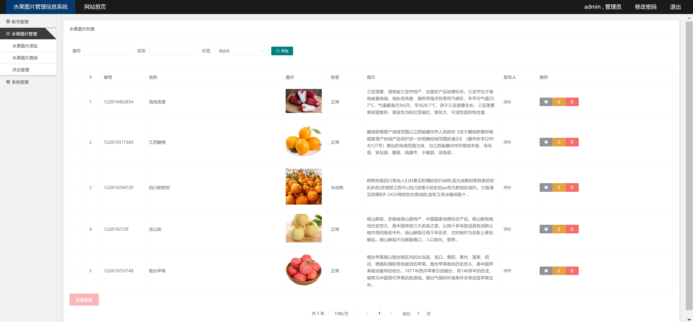

<h1 align="center">水果图片管理系统</h1>

## 简介
水果图片管理系统：角色分为管理员、用户；功能包括水果图片添加、查询、评论管理、用户管理、数据统计等，界面简洁，方便高效地管理和操作水果图片信息。    --计算机毕业设计源码；毕设源码；java毕业设计源码

## 联系方式

<h3 align="center">获取完整代码与数据库文件 + 微信：bysj5151 QQ: 86050149 QQ群: 783742310</h3>

<h3 align="center">可帮忙远程部署 包运行成功！提供远程部署、修改代码、设计文档指导、代码讲解等服务！</h3>

## 功能介绍（完整见运行截图）
管理员：基本功能包括登录和退出，能够通过左侧导航栏进行管理员账号管理、添加用户、密码修改及系统管理。可进行水果图片的添加、编辑、删除，包括上传图片、填写简介等操作，并管理用户评论。提供搜索功能，支持按照水果编号、名称、标签进行查询。可通过顶部导航栏查看管理员信息并更改密码，支持用户信息的高效管理和维护。

普通用户：基本功能包括登录和注册，可以通过主页浏览水果图片，查看名称和简介。用户可使用搜索功能筛选水果信息，利用标签进行分类查找。用户中心提供个人信息查看与修改功能，便于用户管理自己的资料。系统提供留言板功能，用户能在此提交反馈或评论，以增加与管理员的互动。

浏览者：能够查看网站首页的水果图片，了解不同种类的水果及其信息。可通过主页的搜索功能筛选水果图片，利用名称、标签（比如正常、腐烂、未成熟）进行筛选。主页上还展示多种水果及其描述，便于了解和获取相关知识。

开发者：负责系统的整体设计和功能实现，包括页面布局、系统设置、用户权限管理等。确保系统界面简约直观，通过功能模块的合理布局和简洁导航提高用户体验和操作效率。开发过程中需注重安全性和易用性，维护系统的稳定运行及数据的安全。

## 运行截图

本代码来源于网络,仅供学习参考使用!

